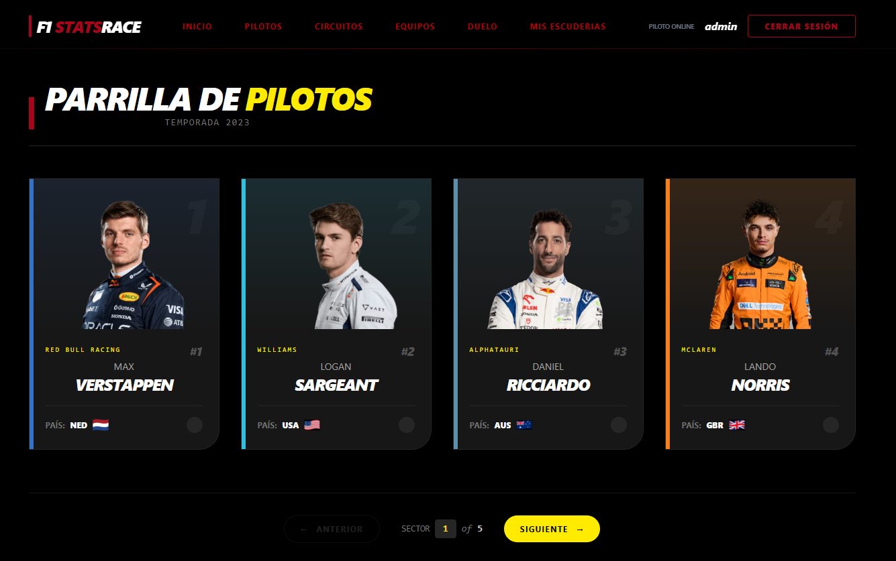
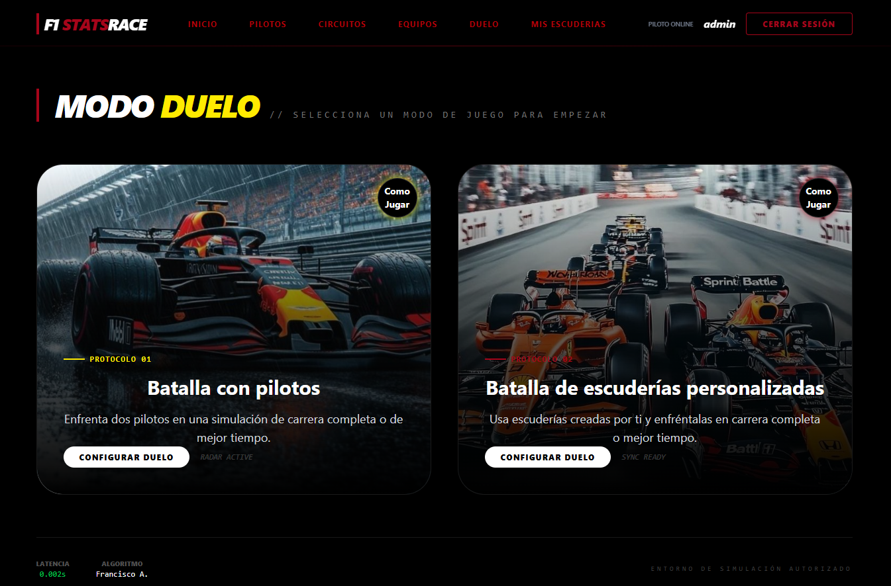
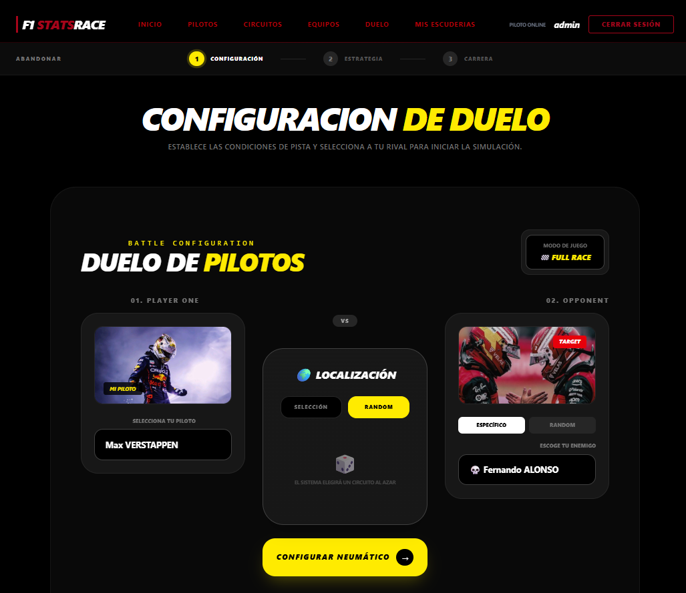
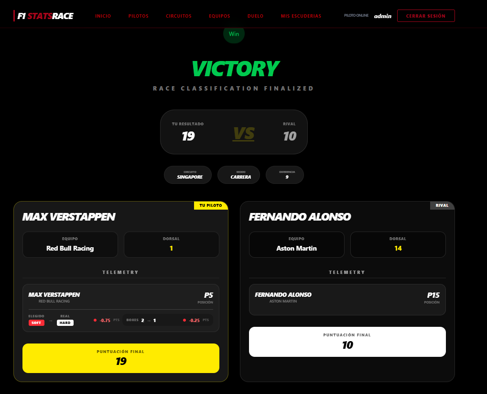
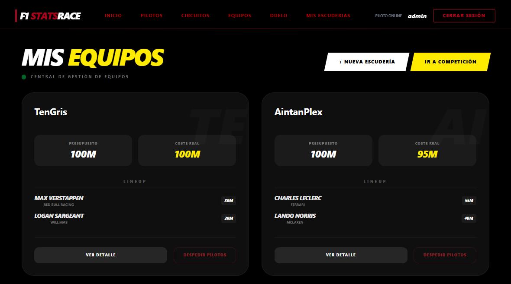

# F1-StatsRace

F1 StatsRace es una aplicación full-stack basada en datos reales de Fórmula 1 mediante OpenF1. Permite consultar pilotos, circuitos y equipos, crear escuderías personalizadas y simular duelos estratégicos entre pilotos o escuderías.

El proyecto combina datos reales con mecánicas tipo manager: selección de neumáticos, predicción de paradas en boxes, bonificaciones, penalizaciones, historial de duelos y recomendaciones mediante IA.

## Funcionalidades

- 🔐 Registro y autenticación de usuarios.
- 🏎️ Consulta de pilotos, equipos y circuitos (OpenF1 API de la temporada 2023).
- 🏁 Creación de escuderías personalizadas con un presupuesto máximo.
- 💰 Sistema de presupuesto para seleccionar pilotos en escuderías personalizadas
- ⚔️ Simulación de duelos entre escuderías personalizadas y pilotos con dos modos de juego (carrera completa o mejor tiempo).
- 🧠 Bonus estratégicos y penalizaciones mediante la selección de compuestos, predicción de paradas en boxes y para las escuderías de química de equipo.
- 📊 Historial de duelos
- 🤖 Recomendación de rival mediante IA.
- ☁️ Backend desplegado en Render.
- 🌐 Frontend desplegado en Netlify/Vercel.
- 🗄️ Base de datos MySQL en Aiven.

## Arquitectura

El proyecto sigue una arquitectura full-stack separada:

- **Frontend:** React + Vite
- **Backend:** Flask (Python)
- **Base de datos:** MySQL
- **API externa:** OpenF1

### Backend
- routes → endpoints
- services → lógica de negocio
- repositories → acceso a datos
- models → ORM (SQLAlchemy)

### Frontend
- pages → vistas principales
- components → UI reutilizable
- services → llamadas a API
- context → gestión de estado (auth)

## Tecnologías

### Backend
- Python
- Flask
- SQLAlchemy
- MySQL

### Frontend
- React
- Vite
- JavaScript

### DevOps
- Docker
- Docker Compose

## Instalación

### 1. Clonar repositorio
```bash
git clone https://github.com/franciscoantoniosanchezdiaz15/F1-StatsRace.git
cd f1-statsrace
```
### 2. Ir al directorio Backend, crear entorno virtual y instalar dependencias
```bash
cd backend
python -m venv .venv
.\.venv\Scripts\pip.exe install -r requirements.txt
```

### 3. Crear archivo .env
```bash
DB_USER=user
DB_PASSWORD=password
DB_HOST=localhost
DB_PORT=3306
DB_NAME=f1statsrace_db

SECRET_KEY=dev_secret_key
FRONTEND_URL=http://localhost:5173

SESSION_COOKIE_SECURE=False
SESSION_COOKIE_SAMESITE=Lax

GROQ_API_KEY=tu_api_key
GROQ_MODEL=llama-3.3-70b-versatile
```

### 4. Inicializar base de datos
```bash
.\.venv\Scripts\flask.exe --app app.main:app db upgrade  
.\.venv\Scripts\flask.exe --app app.main:app seed  
```

### 5. Ejecutar servidor
```bash
.\.venv\Scripts\python.exe -m app.main
```

### 6. Servidor disponible
```bash
http://localhost:5000
```

### 7. Ir al directorio Frontend
```bash
cd frontend
npm install
```

### 8. Crear archivo .env
```bash
VITE_API_URL=http://localhost:5000
```

### 9. Ejecutar fronted
```bash
npm run dev
```

## Limitaciones
- Datos limitados a temporada 2023 de F1
- Dependencia de API OpenF1

## Mejoras futuras

- Soporte multi-temporada
- Sistema de ligas entre usuarios
- Ranking global

## Autor

Francisco Antonio Sánchez Díaz

## Demostración










